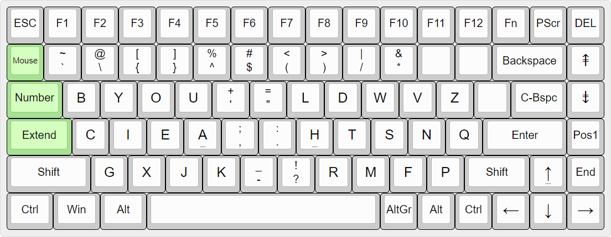
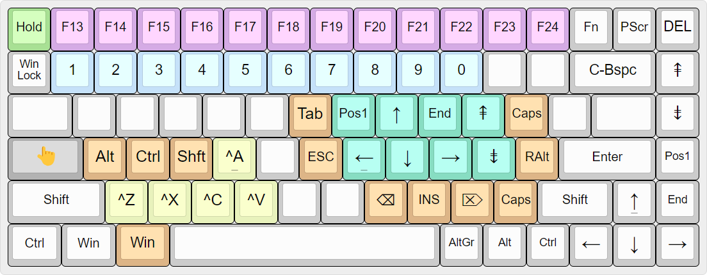
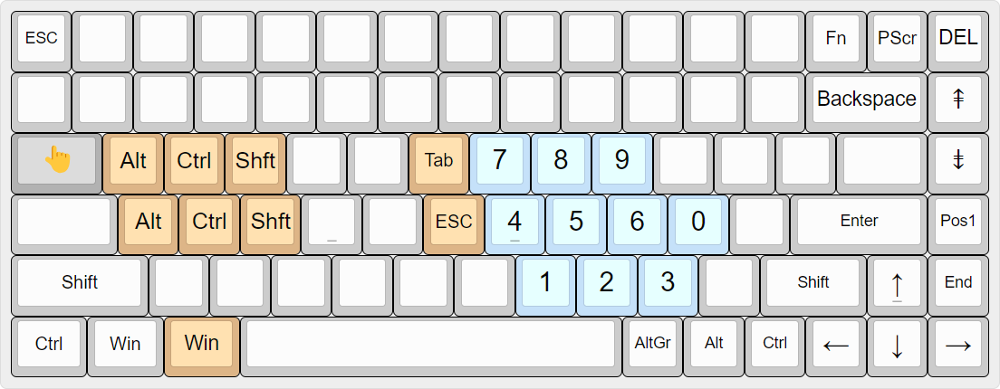
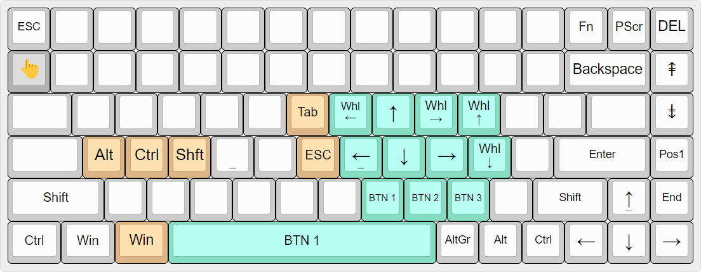
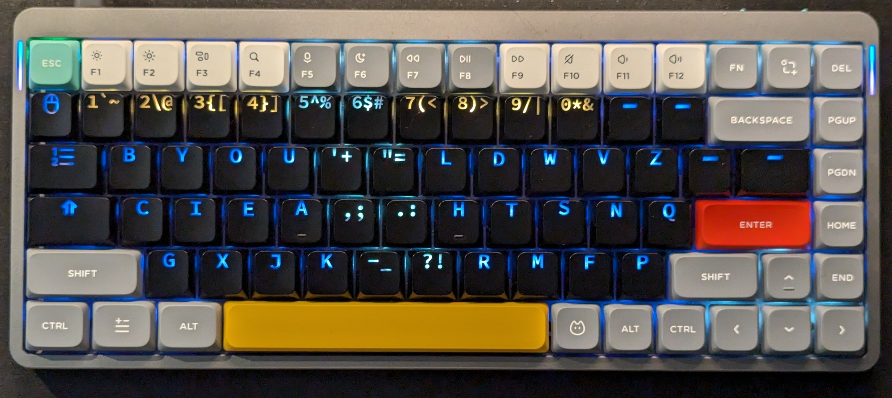
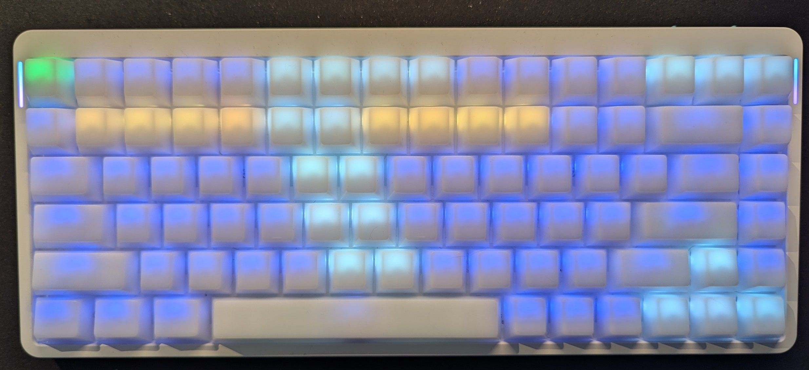

# Engram layout with german umlauts on hold.


## Umlauts

Hold one of the keys [auoAUOs] for a little moment. (See `config.h` the constant `TAPPING_TERM`)
This functionality requires  to have on Windows the application WinCompose installed.
It shall be configured to react on right-alt as compose key.

````
<Multi_key> <"><a> : "ä" # Umlaut ä
<Multi_key> <"><A> : "Ä" # Umlaut Ä
<Multi_key> <"><u> : "ü" # Umlaut ü
<Multi_key> <"><U> : "Ü" # Umlaut Ü
<Multi_key> <"><o> : "ö" # Umlaut ö
<Multi_key> <"><O> : "Ö" # Umlaut Ö
<Multi_key> <s><z> : "ß" # Scharf ß
````

## The Default layer



Engram for the normal letters.
For the symbols, another ordering is chosen, because the pairs `()` and `<>` are harder to press with shifted keys on different hands.
The ordering does now have some similarities to QWERTY (grav, tilde, at, percent are on the original position).
Those keys that are far away from the right pinky - stay unused.

## Extend Layer



Cursor, Page up/down, tab, esc, bspc, ins, del, caps .. all an the right hand.
The left hand, while pressing the layer activation, can still press modifiers. Note the key left of the space bar is now also the windows key, to be more easy to press while the "Extend" key is held.
E.g. Windows+Arrow to move a window.

The usual undo, cut, copy, paste are at their original QWERTY positions. Instead of Ctrl-X, now you press Ext-X.

The Function row does now have the upper half of function keys `F13` .. `F24` and they can be bound in applications.


## Number layer




The left alt on bottom row in now WIN key, so it can be easier pressed with the thumb. E.g. Windows+Number to open a taskbar application.

## Mouse layer



Move the mouse with the keyboard.

## Special Shortcuts

Printscreen: Fn + Prntscreen. Fn to avoid accidental interruption when hitting print screen during backspace press.

Microphone mute/unmute: Fn + Del

Alt-Tab, Win-Tab, Ctrl-Tab: They are still working, although the Tab key normally activates the number layer

Ext-Mse: Windows Lock

Ext-Esc: Extend layer permanent active

## Side LED

The side LED normally shows an animation.

When the Extend, Navigation or mouse layer is active, the left LED shows a color to indicate the layer activity.

When the CapsLock is active, the right LED shows a color.


## Background color

The background color can be configured per layer.
In the base layer is show  a pattern to help to find the split left/right hand and the groups of function keys.



